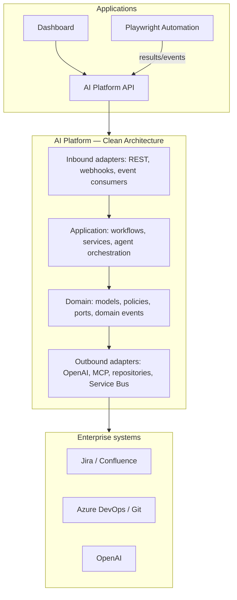
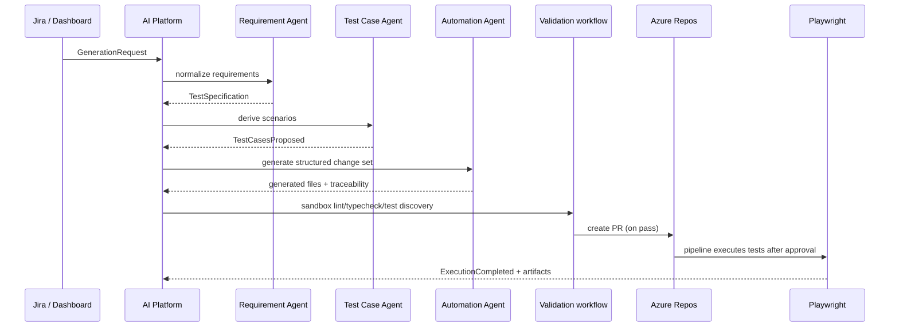
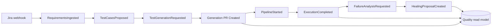
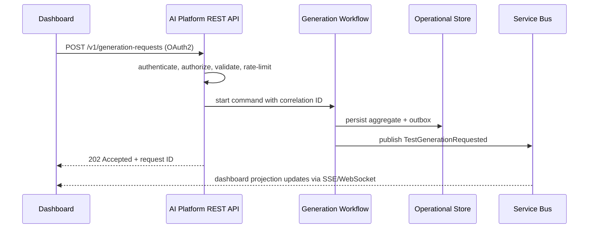
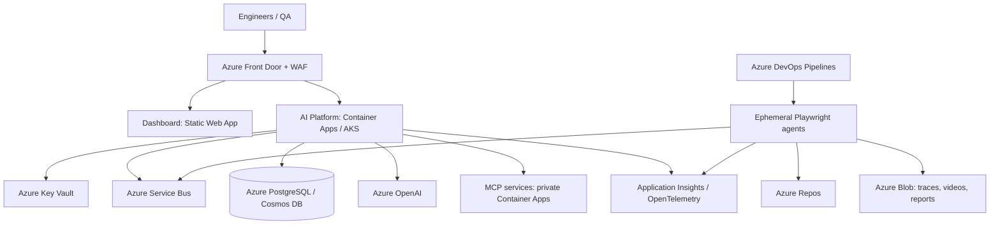

# AI-Driven QA Automation Platform

Enterprise monorepo for AI-assisted quality engineering. It starts with browser UI automation and is deliberately shaped so API, contract, mobile, and performance test adapters can be added without changing the core domain.

## Principles

- **Domain-driven design:** `Test Specification`, `Test Asset`, `Execution`, `Finding`, and `Quality Signal` are bounded contexts with explicit contracts.
- **Clean Architecture:** HTTP, MCP, OpenAI, Git, Jira, Azure DevOps, and persistence are replaceable adapters around application workflows and domain models.
- **Safe generation:** AI creates a proposed change, validation gates it, and Git promotion is policy-controlled. An LLM never receives direct credentials or unrestricted shell access.
- **Observable by default:** every request/event carries a correlation ID; audit records retain prompt version, model, source references, tool calls, and approvals.

## Repository map

See [the complete directory responsibility map](docs/architecture/README.md) for every folder.

```text
ai-qa-platform/
├── apps/
│   ├── automation/       Playwright test framework and generated test destination
│   ├── ai-platform/      Node.js orchestration, domain workflows, AI agents and adapters
│   └── dashboard/        Quality insights, approvals and operations UI
├── packages/             Versioned shared contracts with no application-to-application imports
├── configs/              Reusable TypeScript, linting, Playwright and Azure Pipeline policy
├── docs/                 Architecture, ADRs and operational runbooks
└── scripts/              Idempotent developer and operational automation
```

## Architecture layers



## Application communication and dependencies

Applications communicate through versioned REST/webhook contracts and Azure Service Bus domain events. They share only `@qa/shared-*` packages; `automation`, `dashboard`, and `ai-platform` must never import each other.

```mermaid
flowchart LR
  D[apps/dashboard] -->|HTTPS / OAuth2| P[apps/ai-platform]
  P -->|Generation PR via Git MCP| A[apps/automation]
  A -->|ExecutionCompleted event| P
  A -->|reports / artifacts| D
  P --> ST[@qa/shared-types]
  P --> SP[@qa/shared-prompts]
  P --> SC[@qa/shared-config]
  P --> SU[@qa/shared-utils]
  A --> ST
  A --> SC
  D --> ST
  D --> SC
```

## AI test-generation and placement flow

1. A Jira change or dashboard request creates a `GenerationRequest` with a correlation ID.
2. Requirement Intelligence collects approved Jira and Confluence material, redacts sensitive data, and emits a normalized specification.
3. Test Case Generation produces traceable scenarios. Automation Generation reads the approved framework manifest, page-object catalog, selector policy, and test-data schema through MCP.
4. It returns a **structured change set**: target path, typed file content, imports, scenario trace IDs, and validation expectations—not arbitrary filesystem commands.
5. The generation workflow permits only these paths: `apps/automation/tests/generated/**`, `tasks/**`, `targets/**`, `fixtures/**`, and `data/**`. It rejects traversal, secrets, unsupported dependencies, and raw credentials.
6. A temporary Git worktree receives the change set. TypeScript, ESLint, Playwright discovery, policy checks, and Code Review Agent run before the Git Agent creates a PR.
7. A required human/code-owner approval promotes generated tests. Azure Pipelines runs them; results are published as `ExecutionCompleted` events.



## AI agents and MCP servers

| Agent | Primary MCP server(s) | Purpose and guardrail |
|---|---|---|
| Requirement Intelligence | `jira-mcp`, `confluence-mcp` | Reads approved requirements and source links; read-only. |
| Test Case Generation | `jira-mcp`, `confluence-mcp`, `test-knowledge-mcp` | Derives traceable cases using a curated test-pattern catalog. |
| Automation Generation | `repo-mcp`, `playwright-mcp`, `test-knowledge-mcp` | Reads framework conventions and DOM/selector evidence; outputs structured files only. |
| Code Review | `repo-mcp`, `quality-gate-mcp` | Reviews PR diff, architecture rules and static-analysis results; no merge permission. |
| Git | `azure-repos-mcp` | Creates branch/commit/PR only after policy validation; scoped repository token. |
| CI/CD | `azure-devops-mcp` | Starts/observes approved pipelines and release gates; no production bypass. |
| Failure Analysis | `azure-devops-mcp`, `playwright-artifacts-mcp`, `observability-mcp` | Correlates failures with traces, screenshots, logs, deployment and incidents. |
| Self-Healing | `repo-mcp`, `playwright-mcp`, `azure-devops-mcp` | Proposes locator changes with DOM evidence; opens a PR, never silently edits main. |

MCP clients live under `apps/ai-platform/mcp/clients`; server adapters and tool allowlists live under `servers` and `tools`. Production MCP servers are independently deployed/authorized. `repo-mcp` is an internal read-only repository-context service; `test-knowledge-mcp`, `quality-gate-mcp`, and `playwright-artifacts-mcp` are platform services to implement alongside this repository.

## Event flow

Azure Service Bus (or a compatible broker behind an event port) carries immutable, versioned events. Consumers are idempotent by `eventId`; the outbox pattern writes state and event intent in one transaction. Dead-letter messages are replayed through a runbook.



## Request flow



## Deployment



## Scalability roadmap

The domain core is test-type neutral. Add `TestExecutor` and `TestGenerator` adapters registered by capability: UI/Playwright now; API (HTTP client), contract (Pact), mobile (Appium), and performance (k6) later. Keep shared specification, generation, review, evidence, and quality-signal workflows intact. Scale stateless API/agent workers horizontally; partition broker subscriptions by tenant/project; isolate executions in short-lived runners; retain artifacts by policy in object storage.

## Local development

```bash
corepack enable
pnpm install
pnpm --filter @qa/automation exec playwright install --with-deps
pnpm lint
pnpm test
```

Copy environment values from a future `.env.example`; use managed identity/Key Vault in cloud environments. Never commit tokens, prompt data containing PII, screenshots with customer data, or test credentials.

## Engineering controls

- Azure AD/OAuth2, tenant/project RBAC, least-privilege MCP scopes, Key Vault, encryption, audit trails, retention policies.
- Signed commits/PR policy, CODEOWNERS for generated paths, dependency/SAST/secret scans, SBOM, image signing, and environment approvals.
- OpenTelemetry traces and metrics across API, agents, MCP calls, workflows, pipeline runs, and browser execution.
- Contract tests for events and APIs; unit tests for domain/application layers; integration tests for adapters; isolated end-to-end tests for each capability.
