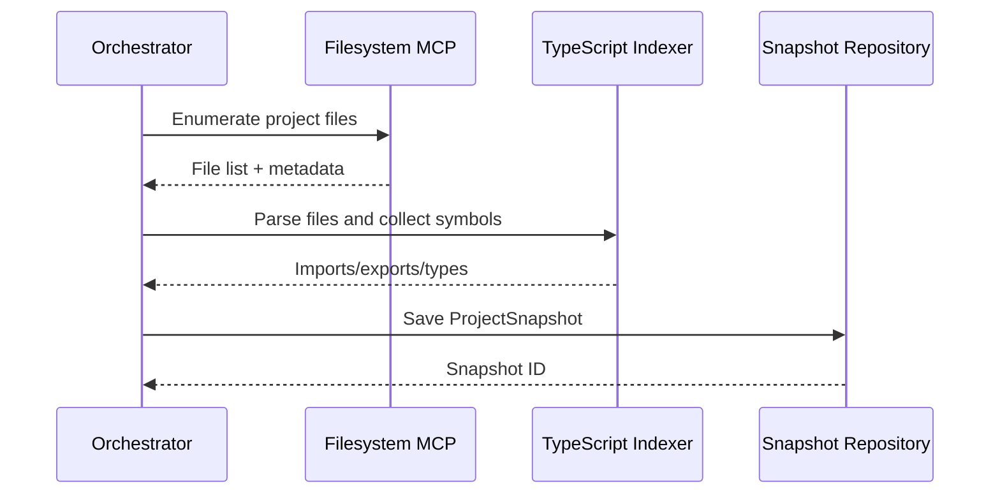
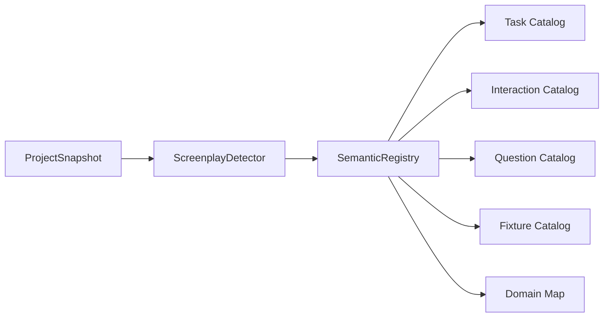
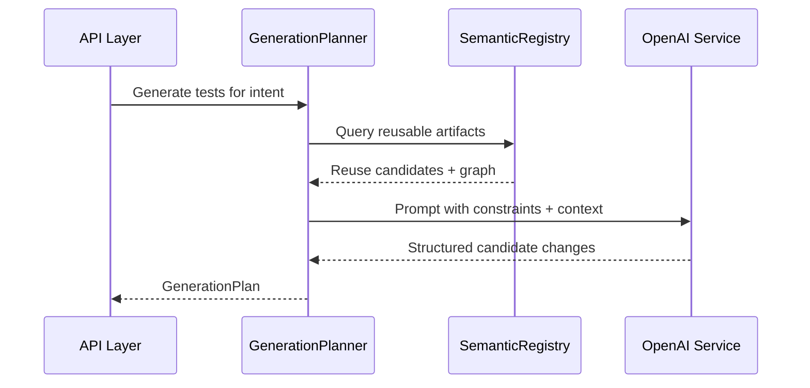
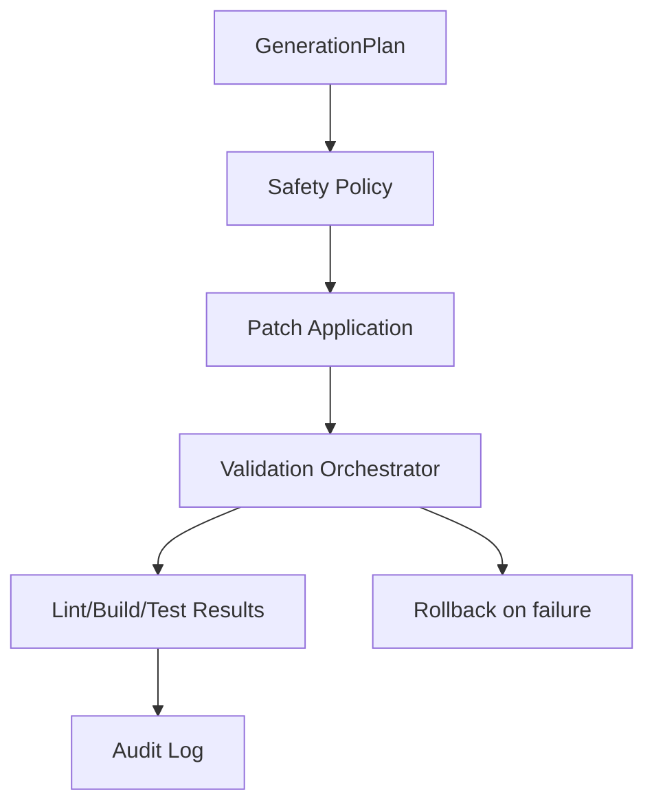
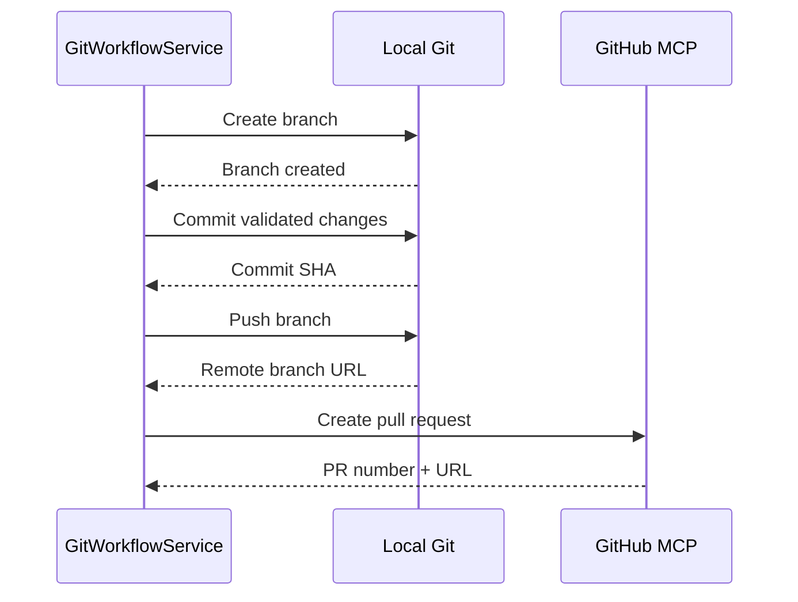
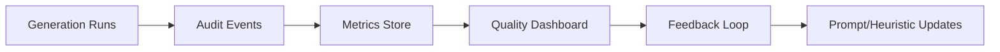
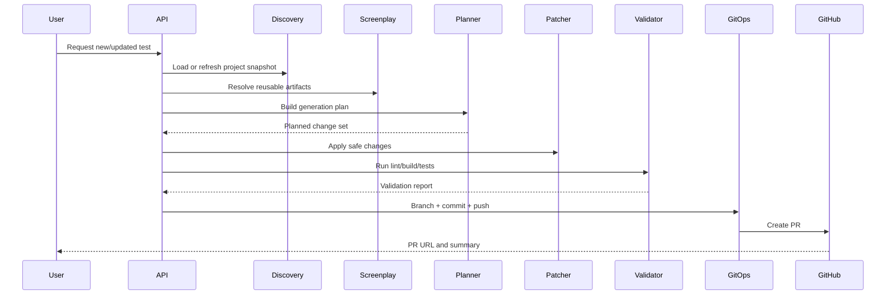

# AI-Powered QA Automation Platform - Implementation Roadmap

## 1. Scope and Principles

### Vision

Build an enterprise AI assistant that can analyze an existing Playwright + Screenplay codebase, generate safe and reusable test changes, and deliver those changes through GitHub pull requests.

### Core Principle: Reuse Existing MCP Servers

We will use existing MCP servers (Filesystem MCP, GitHub MCP, and related platform MCP integrations) instead of building custom MCP servers.

The implementation will focus on orchestration, policy enforcement, domain logic, and quality gates on top of existing MCP capabilities.

### Architecture Principles

- Clean Architecture (domain-centric, framework-independent use cases)
- SOLID design
- Reuse before create
- Safe, auditable file modification
- Minimal diffs, deterministic outputs where possible
- Human-reviewable pull requests with validation evidence

---

## 2. End-State Capabilities

The platform must be able to:

- Read the entire Playwright project
- Understand project architecture and Screenplay Pattern
- Detect and map existing Tasks, Questions, Interactions, Components, Fixtures
- Generate new Playwright tests
- Reuse existing code whenever possible
- Create only missing files
- Modify existing files safely
- Create Git branches
- Commit changes
- Push changes
- Create GitHub pull requests

---

## 3. Reference Context (Current Repository)

### Target Project Layout

- `apps/automation`: existing Playwright + TypeScript + Screenplay project
- `apps/ai-platform`: AI orchestration platform

### Existing AI Platform Folders

- `agents/`
- `api/`
- `events/`
- `llm/`
- `mcp/clients/`, `mcp/servers/`, `mcp/tools/`
- `models/`
- `prompts/`
- `repositories/`
- `services/`
- `utils/`
- `workflows/`

---

## 4. Logical Phases

## Phase 1 - Repository Discovery and Static Knowledge Graph

### Goal

Build a reliable static understanding of the Playwright repository and automation architecture.

### Why it exists

No generation or safe editing should happen before full repository awareness.

### Deliverables

- Repository scanner and file manifest
- TypeScript-aware module and symbol index
- Dependency graph and alias resolution (`@automation/*`)
- Persisted project snapshot

### Components

- `DiscoveryOrchestrator`
- `FileManifestService`
- `TypeScriptIndexService`
- `DependencyGraphService`
- `SnapshotRepository`

### Dependencies

- Filesystem MCP
- TypeScript parser/indexing utilities
- Existing repository structure

### Risks

- Parser drift on mixed TS/JS modules
- Alias resolution gaps
- Performance on large scans

### Acceptance Criteria

- 100% enumeration of files under `apps/automation`
- Imports/exports indexed for test-relevant layers
- Snapshot can be reloaded without full re-scan

### Suggested Folder Structure

- `services/discovery/`
- `repositories/project-snapshot/`
- `models/discovery/`

### Key Classes

- `ProjectSnapshot`
- `SourceFileRecord`
- `ImportEdge`
- `SymbolRecord`

### Interfaces

- `IFileSystemGateway`
- `ITypeScriptIndexer`
- `IProjectSnapshotRepository`

### Data Models

- `ProjectManifest`
- `ModuleGraph`
- `SymbolIndex`
- `ScanDiagnostics`

### Sequence Diagram

### Data Flow

Filesystem -> parser/indexer -> normalized project graph -> snapshot store

### Request Flow

`scanProject` -> list/read files -> parse -> graph build -> snapshot persist

---

## Phase 2 - Screenplay Pattern Intelligence

### Goal

Detect Screenplay Pattern artifacts and build semantic understanding of reusable building blocks.

### Why it exists

Generation quality depends on correctly identifying business and technical abstractions.

### Deliverables

- Screenplay detector
- Semantic registry for Tasks, Questions, Interactions, Pages, Fixtures, Components
- Cross-reference map (who uses what)
- Domain tagging of tests (authentication, checkout, products, etc.)

### Components

- `ScreenplayDetectorService`
- `ArtifactClassifier`
- `SemanticRegistryService`
- `DomainTaxonomyService`

### Dependencies

- Phase 1 snapshot and symbol graph
- Existing architecture conventions

### Risks

- False positives from utility wrappers
- Misclassification of composed tasks
- Incomplete fixture-to-test linkage

### Acceptance Criteria

- Artifacts in all Screenplay layers are detected and indexed
- Linkage graph exists: test -> task -> interaction -> page target
- Reuse candidates can be queried by capability

### Suggested Folder Structure

- `services/screenplay/`
- `models/screenplay/`
- `repositories/semantic-registry/`

### Key Classes

- `ScreenplayArtifact`
- `TaskDescriptor`
- `InteractionDescriptor`
- `QuestionDescriptor`
- `FixtureDescriptor`

### Interfaces

- `IScreenplayDetector`
- `ISemanticRegistry`

### Data Models

- `ScreenplayGraph`
- `CapabilityTag`
- `ReuseCandidate`
- `DomainMap`

### Architecture Diagram

### Data Flow

Snapshot -> classifier -> semantic registry -> queryable reuse metadata

### Request Flow

`analyzeScreenplay` -> detect artifacts -> classify -> persist semantic graph

---

## Phase 3 - Test Planning and Reuse-First Generation

### Goal

Convert business intent into a structured change plan that maximizes reuse and minimizes new code.

### Why it exists

The platform must reason before generating, and only generate what is missing.

### Deliverables

- `TestIntent` schema
- Reuse scoring engine
- Gap analysis (missing files only)
- Generation plan (create/modify/reuse sets)
- Prompt assembly pipeline for OpenAI SDK

### Components

- `TestIntentParser`
- `ReuseScoringService`
- `GapAnalysisService`
- `GenerationPlanner`
- `PromptComposer`
- `OpenAICompletionService`

### Dependencies

- Phase 2 semantic registry
- OpenAI SDK
- Prompt templates

### Risks

- Over-generation of redundant artifacts
- Prompt ambiguity
- Poor quality from weak context packaging

### Acceptance Criteria

- Every plan includes explicit reuse candidates
- New file creation is justified and traceable
- Generated output references existing artifacts where possible
- Plan output is machine-checkable before patching

### Suggested Folder Structure

- `services/generation/`
- `models/generation/`
- `prompts/templates/`

### Key Classes

- `TestIntent`
- `GenerationPlan`
- `ReuseDecision`
- `PatchInstruction`

### Interfaces

- `IIntentParser`
- `IReuseScorer`
- `IGenerationPlanner`
- `ILLMGateway`

### Data Models

- `PlannedChangeSet`
- `FileAction` (`create`, `modify`, `skip`)
- `ArtifactDependency`

### Sequence Diagram

### Data Flow

User intent -> reuse/gap analysis -> LLM proposal -> structured generation plan

### Request Flow

`planGeneration` -> query registry -> score reuse -> call LLM -> return plan

---

## Phase 4 - Safe Change Application and Validation Gates

### Goal

Apply only approved minimal changes with safety checks and deterministic validation.

### Why it exists

Enterprise automation requires non-destructive, auditable modification of source files.

### Deliverables

- Patch application engine
- File safety policy (only allowed folders/layers)
- Conflict and overwrite protections
- Validation pipeline (lint, build, selected tests)
- Rollback strategy

### Components

- `PatchApplicationService`
- `SafetyPolicyService`
- `ValidationOrchestrator`
- `RollbackService`
- `ChangeAuditService`

### Dependencies

- Phase 3 generation plan
- Filesystem MCP
- Existing scripts (`lint`, `build`, `test`)

### Risks

- Local uncommitted changes collision
- Partial writes
- Build failures after patch

### Acceptance Criteria

- Changes are applied transactionally
- Existing files are modified only when required
- New files are created only if missing
- Validation status captured with logs and artifacts
- Rollback possible on failure

### Suggested Folder Structure

- `services/patching/`
- `services/validation/`
- `models/changes/`

### Key Classes

- `PatchOperation`
- `ChangeSet`
- `ValidationResult`
- `PolicyViolation`

### Interfaces

- `IPatchApplier`
- `ISafetyPolicy`
- `IValidationRunner`

### Data Models

- `AuditRecord`
- `RollbackPoint`
- `ValidationReport`

### Architecture Diagram

### Data Flow

Plan -> policy checks -> patch apply -> validation -> audit/rollback state

### Request Flow

`applyPlan` -> validate scope -> patch files -> run checks -> persist result

---

## Phase 5 - Git Workflow and PR Automation

### Goal

Automate branch creation, commit, push, and PR creation with complete traceability.

### Why it exists

Generated work must flow through normal engineering governance via pull requests.

### Deliverables

- Git workflow orchestrator
- Branch naming strategy
- Commit message policy
- PR description builder with change summary
- GitHub PR creation and metadata capture

### Components

- `GitWorkflowService`
- `BranchService`
- `CommitService`
- `PushService`
- `PullRequestService`
- `PRSummaryService`

### Dependencies

- GitHub MCP
- Local git repository
- Phase 4 validated changes

### Risks

- Branch collisions
- Remote auth/permission failures
- Wrong base branch selection

### Acceptance Criteria

- Branch is created from configured base
- Commit includes only intended files
- Push succeeds to remote
- PR created with clear summary, risks, and validation status
- PR metadata linked to internal run ID

### Suggested Folder Structure

- `services/git/`
- `models/git/`
- `workflows/pr/`

### Key Classes

- `GitRunContext`
- `BranchSpec`
- `CommitSpec`
- `PullRequestSpec`

### Interfaces

- `IGitGateway`
- `IGitHubGateway`
- `IPRSummaryBuilder`

### Data Models

- `BranchMetadata`
- `CommitMetadata`
- `PullRequestMetadata`

### Sequence Diagram

### Data Flow

Validated change set -> git branch/commit/push -> PR metadata

### Request Flow

`openPullRequest` -> branch -> commit -> push -> create PR -> return URL

---

## Phase 6 - Governance, Observability, and Continuous Improvement

### Goal

Establish production-grade controls, metrics, and learning loops.

### Why it exists

To ensure reliability, compliance, and iterative quality improvements over time.

### Deliverables

- Policy governance (what can be changed, where, and by whom)
- Full event/audit trail
- Metrics dashboard (reuse ratio, success rate, validation pass rate)
- Feedback ingestion from review outcomes
- Improvement backlog for prompts and heuristics

### Components

- `GovernanceService`
- `AuditEventPublisher`
- `MetricsService`
- `FeedbackIngestionService`
- `QualityImprovementService`

### Dependencies

- Phase 1-5 telemetry and metadata
- Event pipeline in `events/`

### Risks

- Excessive policy strictness slowing delivery
- Incomplete telemetry reducing insight quality

### Acceptance Criteria

- Every run is traceable end-to-end
- Quality metrics are queryable per phase and per domain
- Prompt and heuristic updates are based on measured outcomes

### Suggested Folder Structure

- `services/governance/`
- `services/observability/`
- `events/producers/`
- `events/consumers/`

### Key Classes

- `GovernanceRule`
- `AuditEvent`
- `GenerationMetrics`
- `FeedbackRecord`

### Interfaces

- `IAuditSink`
- `IMetricsStore`
- `IFeedbackStore`

### Data Models

- `RunTrace`
- `QualityReport`
- `ImprovementAction`

### Architecture Diagram

### Data Flow

Runtime events -> audit/metrics -> quality insights -> roadmap updates

### Request Flow

`reviewRunQuality` -> aggregate metrics -> identify gaps -> propose improvements

---

## 5. End-to-End Request Lifecycle

---

## 6. How Each Phase Builds on the Previous One

- Phase 1 creates raw project knowledge required for any downstream reasoning.
- Phase 2 transforms raw knowledge into Screenplay semantics and reuse metadata.
- Phase 3 uses semantics to produce reuse-first, minimal generation plans.
- Phase 4 safely materializes those plans into source changes with quality gates.
- Phase 5 operationalizes validated changes via GitHub pull requests.
- Phase 6 closes the loop with governance, observability, and continuous learning.

---

## 7. Suggested Milestone Plan

### Milestone A

Phase 1 + Phase 2 complete. Outcome: trustworthy project and Screenplay intelligence.

### Milestone B

Phase 3 complete. Outcome: generation plans with explicit reuse and gap decisions.

### Milestone C

Phase 4 complete. Outcome: safe patching and validation in local workflow.

### Milestone D

Phase 5 complete. Outcome: full branch-to-PR automation.

### Milestone E

Phase 6 complete. Outcome: governed and measurable production operation.

---

## 8. Definition of Done (Program Level)

The program is considered complete when:

- The agent reads and understands the full Playwright Screenplay project.
- Generated tests reuse existing Tasks/Questions/Interactions whenever available.
- Only missing files are created and existing files are modified safely.
- Branch, commit, push, and PR creation are fully automated.
- Every run is validated, audited, and observable.
- Existing MCP servers are used as infrastructure adapters, with no custom MCP server runtime required for baseline delivery.
