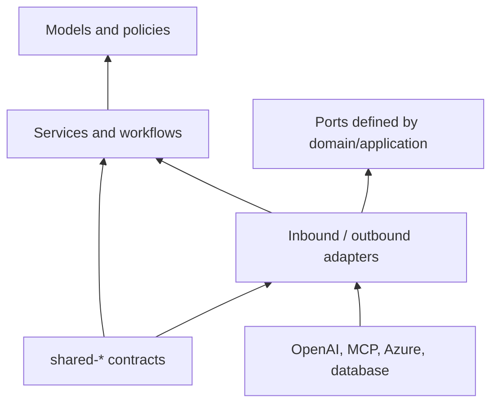

# Architecture reference

## Full directory tree

```text
apps/
├── automation/
│   ├── tests/{e2e,generated,smoke,regression}/
│   ├── {actors,abilities,interactions,questions,tasks,targets}/
│   ├── {fixtures,helpers,utils,data,config,reporters}/
│   └── playwright.config.ts
├── ai-platform/
│   ├── agents/{requirement-intelligence,test-case-generation,automation-generation,code-review,git,cicd,failure-analysis,self-healing}/
│   ├── services/  llm/  prompts/  models/  workflows/  repositories/  utils/
│   ├── mcp/{clients,servers,tools}/
│   ├── api/{routes,controllers,middleware}/
│   └── events/{producers,consumers,schemas}/
└── dashboard/
    ├── public/
    └── src/{features,components,pages,services,state}/
packages/
├── shared-types/src/
├── shared-prompts/src/
├── shared-config/src/
└── shared-utils/src/
configs/{typescript,eslint,playwright,ci}/
docs/{architecture,adr,runbooks}/
scripts/
```

## Complete folder responsibility map

| Path | Responsibility |
|---|---|
| `apps/automation` | UI quality product: the Playwright framework, its conventions and test assets. |
| `apps/automation/tests` | Test suites organized by execution intent. `e2e`, `smoke`, and `regression` are curated suites; `generated` is the controlled AI output staging area. |
| `apps/automation/actors` | Screenplay actors that coordinate abilities, tasks, interactions, and questions. |
| `apps/automation/abilities` | Actor capabilities; `BrowseTheWeb` is the initial Playwright browser capability. |
| `apps/automation/interactions` | Small reusable UI actions such as click, enter, select, and upload. |
| `apps/automation/questions` | Reusable application-state reads used by test assertions. |
| `apps/automation/tasks` | Business-level workflows composed from interactions, such as sign-in and checkout. |
| `apps/automation/targets` | Named, reusable UI locators owned by feature rather than Page Objects. |
| `apps/automation/fixtures` | Typed Playwright fixtures and test lifecycle composition. |
| `apps/automation/helpers` | Domain-focused test setup/action helpers; no raw infrastructure logic. |
| `apps/automation/utils` | Small deterministic framework utilities, such as polling and formatting. |
| `apps/automation/data` | Versioned non-secret test data, factories and schemas. |
| `apps/automation/config` | App-level environment, project and execution configuration. |
| `apps/automation/reporters` | Azure DevOps and enterprise report publishing adapters. |
| `apps/ai-platform` | Backend bounded-context host and composition root. |
| `apps/ai-platform/agents` | Agent policies and orchestration for requirement intelligence, test cases, automation, review, Git, CI/CD, failure analysis and healing. Each named child directory owns that agent's prompt/policy implementation. |
| `apps/ai-platform/services` | Application services/commands/queries that coordinate domain objects and ports. |
| `apps/ai-platform/llm` | OpenAI SDK adapter, model routing, redaction, token budgets, response schemas and evaluation hooks. |
| `apps/ai-platform/mcp` | MCP boundary. `clients` invoke servers, `servers` host internal services, and `tools` defines allowlisted typed tools. |
| `apps/ai-platform/mcp/clients` | Authenticated MCP client configurations and protocol adapters. |
| `apps/ai-platform/mcp/servers` | Internal MCP server implementations exposed under service identity. |
| `apps/ai-platform/mcp/tools` | JSON schemas, authorization policies and implementations for agent-callable tools. |
| `apps/ai-platform/prompts` | Versioned, tested prompt templates local to a bounded context; shared policy belongs in `shared-prompts`. |
| `apps/ai-platform/models` | Domain aggregates, value objects, domain policies, ports and domain events. |
| `apps/ai-platform/workflows` | Long-running, compensating orchestration such as generation, review, pipeline and healing workflows. |
| `apps/ai-platform/api` | Inbound REST boundary. `routes` map endpoints, `controllers` adapt HTTP, `middleware` enforces auth/validation/correlation/rate limits. |
| `apps/ai-platform/events` | Async boundary. `producers` publish outbox events, `consumers` handle subscriptions, `schemas` version event contracts. |
| `apps/ai-platform/repositories` | Persistence adapters and aggregate repositories; no business rules. |
| `apps/ai-platform/utils` | Backend-only technical utilities with no domain knowledge. |
| `apps/dashboard` | Web application for quality trends, test evidence, approvals, and operational control. |
| `apps/dashboard/src/features` | Feature slices and view models. |
| `apps/dashboard/src/components` | Reusable presentational UI components. |
| `apps/dashboard/src/pages` | Routed screens and composition. |
| `apps/dashboard/src/services` | API/SSE client adapters. |
| `apps/dashboard/src/state` | Client state, query cache and authorization-aware stores. |
| `apps/dashboard/public` | Static browser assets. |
| `packages/shared-types` | Stable, versioned cross-app DTO/event types; no runtime infrastructure dependencies. |
| `packages/shared-prompts` | Organization-wide prompt policies, guardrails and evaluators. |
| `packages/shared-config` | Typed, environment-neutral configuration contracts and defaults. |
| `packages/shared-utils` | Pure common utilities. |
| `configs/typescript` | Base TypeScript compiler policy. |
| `configs/eslint` | Shared static-analysis and architectural-boundary rules. |
| `configs/playwright` | Organization-wide execution/reporting defaults. |
| `configs/ci` | Azure Pipelines templates and release quality gates. |
| `docs/architecture` | This architecture reference and diagrams. |
| `docs/adr` | Architecture Decision Records; immutable decisions with context and consequences. |
| `docs/runbooks` | Operable procedures for incidents, replay, recovery and releases. |
| `scripts` | Idempotent local/CI operational tooling. |

## Dependency rules



Domain code may not import Node HTTP, OpenAI SDK, MCP SDK, Azure SDK, Playwright, or database libraries. Workflows depend on interfaces; adapter wiring occurs only in the application composition root. Event schemas are backward compatible: add optional fields, version breaking topics, and retain consumers during migration.

## Generated-test contract

The Automation Generation Agent emits JSON conforming to a schema similar to:

```ts
type GeneratedChange = {
  path: `apps/automation/${string}`;
  content: string;
  kind: 'test' | 'page' | 'component' | 'fixture' | 'data';
  requirementIds: string[];
  evidence: { source: string; selector?: string }[];
};
```

The generation service validates the prefix and extension, parses TypeScript, checks approved imports and selector policy, then writes only into an isolated worktree. Every PR includes requirement links, prompt/model version, source evidence, checks run, and an explicit non-production test-data statement.
